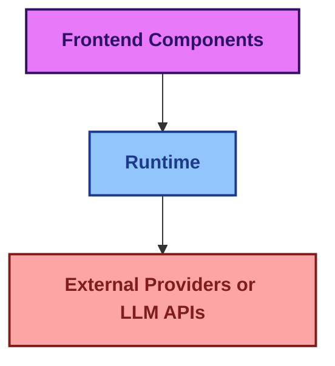
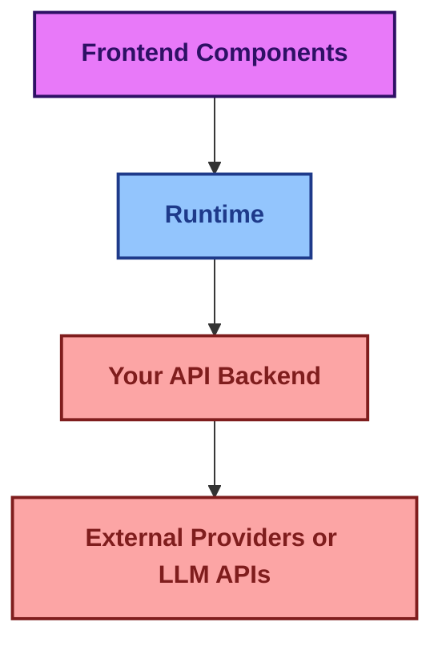
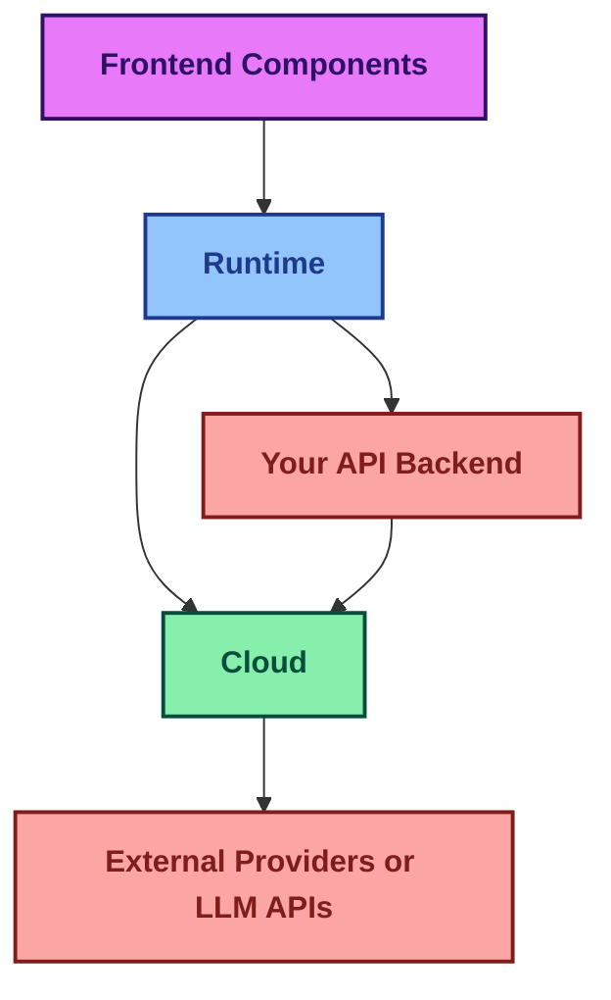

import { Sparkles, PanelsTopLeft, Database, Terminal } from "lucide-react";

## assistant-ui is built on these main pillars:

    <Card title='1. Frontend components'>
        Shadcn UI chat components with built-in state management
    </Card>

    <Card title='2. Runtime'>
        State management layer connecting UI to LLMs and backend services
    </Card>

    <Card title='3. Assistant Cloud'>
        Hosted service for thread persistence, history, and user management
    </Card>

### 1. Frontend components
Stylized and functional chat components built on top of Shadcn components that have context state management provided by the assistantUI runtime provider. These pre-built React components come with intelligent state management. [View our components](/docs/ui/thread)

### 2. Runtime
A React state management context for assistant chat. The runtime handles data conversions between the local state and calls to backends and LLMs. We offer different runtime solutions that work with various frameworks like Vercel AI SDK, LangGraph, LangChain, Helicone, local runtime, and an ExternalStore when you need full control of the frontend message state. [You can view the runtimes we support](/docs/runtimes/pick-a-runtime)

### 3. Assistant Cloud
A hosted service that enhances your assistant experience with comprehensive thread management and message history. Assistant Cloud stores complete message history, automatically persists threads, supports human-in-the-loop workflows, and integrates with common auth providers to seamlessly allow users to resume conversations at any point. [Cloud Docs](/docs/cloud)

## What each layer owns

Before picking a runtime or wiring components, it helps to see which layer owns which responsibility. assistant-ui draws hard lines between rendering, conversation state, and where the model actually runs.

### UI layer
Primitives and prebuilt components render the assistant experience: thread, messages, composer, message parts, actions, attachments, suggestions. They read and write through the runtime context, not directly against the backend or model.

### Runtime layer
The state and behavior boundary between UI and backend. The runtime owns or adapts conversation state: messages, thread state, composer state, run lifecycle, branching, editing, regeneration. Different runtimes exist because different backends own this state differently. `LocalRuntime` keeps state internal; `ExternalStoreRuntime` delegates to your store.

### Backend / agent layer
Produces assistant output and app-specific behavior. Depending on the runtime and protocol, the backend may emit text, message parts, tool calls, metadata, agent state, attachments, or other events that the runtime maps into UI state.

### Integration / protocol layer
Runtime adapters and protocols bridge assistant-ui to different backend shapes: AI SDK, LangGraph, LangChain, ADK, A2A, AG-UI, OpenCode, or your own. The DataStream and AssistantTransport protocols let a generic backend talk to assistant-ui without a custom adapter per app.

### Persistence layer
Thread and message history can be stored by Assistant Cloud or by your own database via thread and history adapters. Persistence is separate from rendering and backend generation, though the runtime coordinates with it.

## There are three common ways to architect your assistant-ui application:

#### **1. Direct Integration with External Providers**

#### **2. Using your own API endpoint**

#### **3. With Assistant Cloud**

## Going deeper

These pages go one level deeper on runtime internals, adapters, and persistence.

<Cards>
  <Card
    title="Runtime architecture"
    description="Core runtimes, protocol layers, and framework adapters — what each layer owns."
    href="/docs/runtimes/concepts/architecture"
  />
  <Card
    title="Adapters"
    description="Attachments, speech, feedback, history, suggestions across runtimes."
    href="/docs/runtimes/concepts/adapters"
  />
  <Card
    title="Threads"
    description="Multi-thread support: cloud, custom database, ExternalStore."
    href="/docs/runtimes/concepts/threads"
  />
</Cards>
