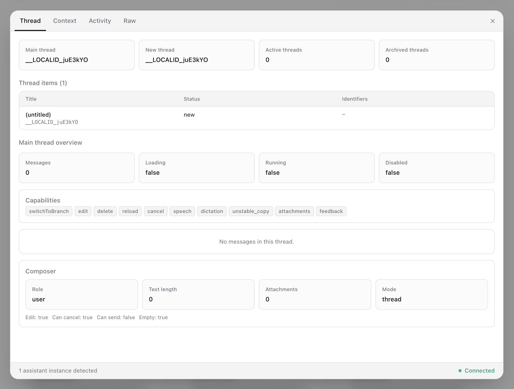

The assistant-ui DevTools allows you to debug the assistant-ui state and context, and events without resorting to `console.log`. It's an easy way to see how data flows to the assistant-ui's runtime layer.



## Setup

<Steps>
  <Step>

### Install the DevTools package

<InstallCommand npm={["@assistant-ui/react-devtools"]} />

  </Step>
  <Step>

### Mount the DevTools modal

```tsx
import { AssistantRuntimeProvider } from "@assistant-ui/react";
import { DevToolsModal } from "@assistant-ui/react-devtools";

export function AssistantApp() {
  const runtime = /* your runtime setup */;
  return (
    <AssistantRuntimeProvider runtime={runtime}>
      <DevToolsModal />
      {/* ...your assistant-ui... */}
    </AssistantRuntimeProvider>
  );
}
```

  </Step>
  <Step>

### Verify the DevTools overlay

That's it! In development builds you should now see the DevTools launcher in the lower-right corner of your site. The panel renders inline in an isolated shadow root, and the whole component is stripped from production builds.


  </Step>
</Steps>

## Custom tabs

The panel is extensible. Pass extra inspector tabs to `DevToolsModal` with `plugins`; each plugin renders from the inspected instance's projected data (`state`, `logs`, `modelContext`, `scopes`).

```tsx
import { createDevToolsPlugin, DevToolsModal } from "@assistant-ui/react-devtools";

const stateTab = createDevToolsPlugin({
  id: "my-state",
  label: "My state",
  Component: ({ data }) => <pre>{JSON.stringify(data.state, null, 2)}</pre>,
});

export function AssistantApp() {
  return (
    <AssistantRuntimeProvider runtime={runtime}>
      <DevToolsModal plugins={[stateTab]} />
      {/* ...your assistant-ui... */}
    </AssistantRuntimeProvider>
  );
}
```
