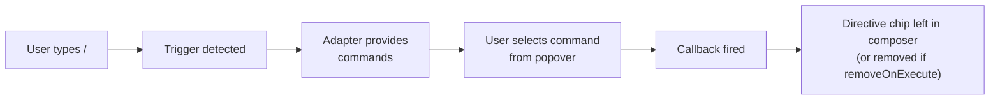

Slash commands let users type `/` in the composer to open a popover, browse available commands, and execute one. Unlike [mentions](/docs/guides/mentions) (which only insert a directive into the message), slash commands additionally fire an **action callback** at the moment of selection.

## How It Works



The slash command system is built on the same [trigger popover architecture](#trigger-popover-architecture) as mentions. A slash command declares its behavior with a `<TriggerPopover.Action>` sub-primitive whose `onExecute` callback fires when an item is chosen.

By default `Action` leaves a directive chip in the composer — giving the user (and the LLM) an audit trail of which commands were invoked. Pass `removeOnExecute` to strip the `/command` text entirely.

## Quick Start

### 1. Define Commands with `unstable_useSlashCommandAdapter`

Declare commands (data + `execute` bundled together, like a toolkit entry). The hook returns `{ adapter, action }` — wire both into a single `<TriggerPopover>`:

```tsx
import {
  ComposerPrimitive,
  unstable_useSlashCommandAdapter,
  type Unstable_SlashCommand,
} from "@assistant-ui/react";

const SLASH_COMMANDS: readonly Unstable_SlashCommand[] = [
  {
    id: "summarize",
    description: "Summarize the conversation",
    execute: () => console.log("Summarize!"),
  },
  {
    id: "translate",
    description: "Translate text to another language",
    execute: () => console.log("Translate!"),
  },
  {
    id: "help",
    description: "List all available commands",
    execute: () => console.log("Help!"),
  },
];

function MyComposer() {
  const slash = unstable_useSlashCommandAdapter({ commands: SLASH_COMMANDS });

  return (
    <ComposerPrimitive.Unstable_TriggerPopoverRoot>
      <ComposerPrimitive.Root>
        <ComposerPrimitive.Input placeholder="Type / for commands..." />
        <ComposerPrimitive.Send>Send</ComposerPrimitive.Send>

        <ComposerPrimitive.Unstable_TriggerPopover
          char="/"
          adapter={slash.adapter}
          className="popover"
        >
          <ComposerPrimitive.Unstable_TriggerPopover.Action {...slash.action} />
          <ComposerPrimitive.Unstable_TriggerPopoverItems>
            {(items) =>
              items.map((item, index) => (
                <ComposerPrimitive.Unstable_TriggerPopoverItem
                  key={item.id}
                  item={item}
                  index={index}
                  className="popover-item"
                >
                  <strong>{item.label}</strong>
                  {item.description && <span>{item.description}</span>}
                </ComposerPrimitive.Unstable_TriggerPopoverItem>
              ))
            }
          </ComposerPrimitive.Unstable_TriggerPopoverItems>
        </ComposerPrimitive.Unstable_TriggerPopover>
      </ComposerPrimitive.Root>
    </ComposerPrimitive.Unstable_TriggerPopoverRoot>
  );
}
```

The label defaults to `/${id}`; override via `label` on the command. Icons are strings that your `iconMap` on the picker UI resolves to components (see [ComposerTriggerPopover](/docs/ui/composer-trigger-popover)).

### `unstable_useSlashCommandAdapter` options

| Option | Type | Default | Description |
| --- | --- | --- | --- |
| `commands` | `Unstable_SlashCommand[]` | — | Command definitions — each has `id`, optional `label`, `description`, `icon`, and an `execute` callback (required) |
| `removeOnExecute` | `boolean` | `false` | When `true`, strips the trigger text from the composer after executing instead of leaving a directive chip |
| `iconMap` | `Record<string, IconComponent>` | — | Maps `metadata.icon` / category `id` strings to React icon components; forwarded to `ComposerTriggerPopover` |
| `fallbackIcon` | `IconComponent` | — | Fallback when no `iconMap` entry matches; forwarded to `ComposerTriggerPopover` |

The hook returns `{ adapter, action, iconMap?, fallbackIcon? }` — spread directly into `<ComposerTriggerPopover char="/" {...slash} />` for one-line wiring.

### 2. Controlling the Chip

By default, a selected `/summarize` is converted into a directive chip (`:command[/summarize]{name=summarize}`) in the composer text and the command's `execute` fires. This keeps an audit trail of which commands were invoked.

To strip the trigger text entirely — useful for purely transient commands — pass `removeOnExecute` on the hook options:

```tsx
const slash = unstable_useSlashCommandAdapter({
  commands: SLASH_COMMANDS,
  removeOnExecute: true,
});
```

### 3. Custom Dispatch

For side effects on top of `execute` (logging, analytics, intercept), wrap the hook's `onExecute`:

```tsx
<ComposerPrimitive.Unstable_TriggerPopover.Action
  onExecute={(item) => {
    logCommandUsed(item.id);
    slash.action.onExecute(item);
  }}
/>
```

## Categorized Commands

For **categorized navigation** (drill-down into groups), return categories from `categories()` and items from `categoryItems()`. The popover shows categories first, then items within the selected category:

```ts
import type { Unstable_TriggerAdapter } from "@assistant-ui/core";

const adapter: Unstable_TriggerAdapter = {
  categories() {
    return [
      { id: "actions", label: "Actions" },
      { id: "export", label: "Export" },
    ];
  },

  categoryItems(categoryId) {
    if (categoryId === "actions") {
      return [
        { id: "summarize", type: "command", label: "/summarize", description: "Summarize the conversation" },
        { id: "translate", type: "command", label: "/translate", description: "Translate text" },
      ];
    }
    if (categoryId === "export") {
      return [
        { id: "pdf", type: "command", label: "/export pdf", description: "Export as PDF" },
        { id: "markdown", type: "command", label: "/export md", description: "Export as Markdown" },
      ];
    }
    return [];
  },

  // Optional — enables search across all categories
  search(query) {
    const lower = query.toLowerCase();
    const all = [...this.categoryItems("actions"), ...this.categoryItems("export")];
    return all.filter(
      (item) => item.label.toLowerCase().includes(lower) || item.description?.toLowerCase().includes(lower),
    );
  },
};
```

When using a categorized adapter, add `TriggerPopoverCategories` to your popover UI:

```tsx
const commandHandlers: Record<string, () => void> = {
  summarize: () => {/* ... */},
  pdf: () => {/* ... */},
};

<ComposerPrimitive.Unstable_TriggerPopover
  char="/"
  adapter={adapter}
>
  <ComposerPrimitive.Unstable_TriggerPopover.Action
    formatter={unstable_defaultDirectiveFormatter}
    onExecute={(item) => commandHandlers[item.id]?.()}
  />
  <ComposerPrimitive.Unstable_TriggerPopoverBack>← Back</ComposerPrimitive.Unstable_TriggerPopoverBack>
  <ComposerPrimitive.Unstable_TriggerPopoverCategories>
    {(categories) => categories.map((cat) => (
      <ComposerPrimitive.Unstable_TriggerPopoverCategoryItem key={cat.id} categoryId={cat.id}>
        {cat.label}
      </ComposerPrimitive.Unstable_TriggerPopoverCategoryItem>
    ))}
  </ComposerPrimitive.Unstable_TriggerPopoverCategories>
  <ComposerPrimitive.Unstable_TriggerPopoverItems>
    {(items) => items.map((item, index) => (
      <ComposerPrimitive.Unstable_TriggerPopoverItem key={item.id} item={item} index={index}>
        {item.label}
      </ComposerPrimitive.Unstable_TriggerPopoverItem>
    ))}
  </ComposerPrimitive.Unstable_TriggerPopoverItems>
</ComposerPrimitive.Unstable_TriggerPopover>
```

## Combining with Mentions

Slash commands and mentions live under the same `TriggerPopoverRoot`. Declare one `TriggerPopover` per trigger — each with its own behavior sub-primitive:

```tsx
<ComposerPrimitive.Unstable_TriggerPopoverRoot>
  <ComposerPrimitive.Root>
    <ComposerPrimitive.Input placeholder="Type @ to mention, / for commands..." />
    <ComposerPrimitive.Send>Send</ComposerPrimitive.Send>

    {/* @ mention popover */}
    <ComposerPrimitive.Unstable_TriggerPopover
      char="@"
      adapter={mention.adapter}
    >
      <ComposerPrimitive.Unstable_TriggerPopover.Directive {...mention.directive} />
      <ComposerPrimitive.Unstable_TriggerPopoverItems>
        {(items) => items.map((item) => (
          <ComposerPrimitive.Unstable_TriggerPopoverItem key={item.id} item={item}>
            {item.label}
          </ComposerPrimitive.Unstable_TriggerPopoverItem>
        ))}
      </ComposerPrimitive.Unstable_TriggerPopoverItems>
    </ComposerPrimitive.Unstable_TriggerPopover>

    {/* / slash command popover */}
    <ComposerPrimitive.Unstable_TriggerPopover
      char="/"
      adapter={slash.adapter}
    >
      <ComposerPrimitive.Unstable_TriggerPopover.Action {...slash.action} />
      <ComposerPrimitive.Unstable_TriggerPopoverItems>
        {(items) => items.map((item, index) => (
          <ComposerPrimitive.Unstable_TriggerPopoverItem key={item.id} item={item} index={index}>
            {item.label}
          </ComposerPrimitive.Unstable_TriggerPopoverItem>
        ))}
      </ComposerPrimitive.Unstable_TriggerPopoverItems>
    </ComposerPrimitive.Unstable_TriggerPopover>
  </ComposerPrimitive.Root>
</ComposerPrimitive.Unstable_TriggerPopoverRoot>
```

Each `TriggerPopover` is its own scope — the `@` popover and the `/` popover read state from their own declaration and never collide. Keyboard events route to whichever popover is currently active.

## Commands with Arguments

Some commands accept inline arguments typed after the command word — for example `/translate en` or `/ask what is TypeScript`. Because the adapter's `search` method receives the full text after `/`, you can split on the first space to separate the command from its arguments:

```tsx
const SLASH_COMMANDS: readonly Unstable_SlashCommand[] = [
  {
    id: "translate",
    description: "Translate to a language, e.g. /translate en",
    execute: () => {/* arguments extracted separately, see below */},
  },
  {
    id: "ask",
    description: "Ask about a topic, e.g. /ask what is TypeScript",
    execute: () => {/* arguments extracted separately, see below */},
  },
];

function MyComposer() {
  const composerRef = useRef<HTMLTextAreaElement>(null);
  const slash = unstable_useSlashCommandAdapter({
    commands: SLASH_COMMANDS.map((cmd) => ({
      ...cmd,
      execute: () => {
        // Read the full composer text to extract arguments
        const raw = composerRef.current?.value ?? "";
        // Match "/<id> <args>" at start of input
        const match = raw.match(new RegExp(`^\\/${cmd.id}\\s+(.*)`));
        const args = match?.[1]?.trim() ?? "";
        handleCommand(cmd.id, args);
      },
    })),
    removeOnExecute: true,
  });

  return (
    <ComposerPrimitive.Unstable_TriggerPopoverRoot>
      <ComposerPrimitive.Root>
        <ComposerPrimitive.Input ref={composerRef} placeholder="Type / for commands..." />
        <ComposerPrimitive.Unstable_TriggerPopover char="/" adapter={slash.adapter}>
          <ComposerPrimitive.Unstable_TriggerPopover.Action {...slash.action} />
          <ComposerPrimitive.Unstable_TriggerPopoverItems>
            {(items) => items.map((item, i) => (
              <ComposerPrimitive.Unstable_TriggerPopoverItem key={item.id} item={item} index={i}>
                <strong>{item.label}</strong>
                {item.description && <span>{item.description}</span>}
              </ComposerPrimitive.Unstable_TriggerPopoverItem>
            ))}
          </ComposerPrimitive.Unstable_TriggerPopoverItems>
        </ComposerPrimitive.Unstable_TriggerPopover>
        <ComposerPrimitive.Send>Send</ComposerPrimitive.Send>
      </ComposerPrimitive.Root>
    </ComposerPrimitive.Unstable_TriggerPopoverRoot>
  );
}
```

`removeOnExecute: true` strips the `/translate en` text from the composer so the argument is consumed by the handler rather than sent to the LLM.

## Async Command Loading

The adapter interface is synchronous, but the command list can come from any async source. Load commands into state (or a query cache) and pass the current snapshot to the hook. Because `unstable_useSlashCommandAdapter` re-runs on every render, the adapter always reflects the latest list.

**With React state:**

```tsx
function MyComposer() {
  const [commands, setCommands] = useState<Unstable_SlashCommand[]>([]);

  useEffect(() => {
    fetchAvailableCommands().then(setCommands);
  }, []);

  const slash = unstable_useSlashCommandAdapter({ commands });

  return (/* ... */);
}
```

**With React Query:**

```tsx
function MyComposer() {
  const { data: commands = [] } = useQuery({
    queryKey: ["slash-commands"],
    queryFn: fetchAvailableCommands,
  });

  const slash = unstable_useSlashCommandAdapter({ commands });

  return (/* ... */);
}
```

## Keyboard Navigation

See [ComposerTriggerPopover keyboard navigation](/docs/ui/composer-trigger-popover#keyboard-navigation) for the full key bindings table.

## Trigger Popover Architecture

Both mentions and slash commands are built on a generic trigger popover system where each `Unstable_TriggerPopover` declares one trigger character, an adapter, and exactly one behavior sub-primitive (`Directive` or `Action`). Multiple triggers coexist under a single `Unstable_TriggerPopoverRoot`. See the [Composer Primitives](/docs/primitives/composer) reference for the complete API.

## Primitives Reference

See the [Composer Primitives](/docs/primitives/composer) reference for the full list of trigger popover primitives and their props.

## Related

- [Mentions Guide](/docs/guides/mentions) — `@`-mention system built on the same architecture
- [Suggestions Guide](/docs/guides/suggestions) — static follow-up prompts (different from slash commands)
- [Composer Primitives](/docs/primitives/composer) — underlying composer primitives
