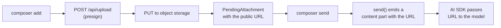

The bundled `SimpleImageAttachmentAdapter` and `SimpleTextAttachmentAdapter` inline files as data URLs. That works for small images and text files but breaks down for large files, persistent threads, and serverless body-size limits. This page shows the production pattern: an `AttachmentAdapter` that uploads to object storage via a presigned URL and sends only the URL to the model.

For the adapter contract itself, see [adapters](/docs/runtimes/concepts/adapters#attachment-adapter). This page is the storage variant.

## How it works



Three ideas to internalize before reading the code:

1. **`add` uploads, returns `requires-action`.** The composer holds the file with the user's other input.
2. **`send` finalizes.** When the user submits, you mark the attachment `complete` and emit a `content` part with a stable URL.
3. **`remove` deletes.** Optional. Runs only if the user removes the attachment from the composer before sending; messages already sent are immutable.

## Setup

<Steps>
<Step>

### Build the presign endpoint

The client cannot mint upload credentials safely; the server creates a short-lived presigned URL. The example below uses S3, but R2, GCS, and Vercel Blob have nearly identical shapes.

```sh title=".env.local"
AWS_REGION=us-east-1
S3_BUCKET=my-chat-uploads
AWS_ACCESS_KEY_ID=...
AWS_SECRET_ACCESS_KEY=...
```

```ts title="app/api/upload/route.ts"
import { S3Client, PutObjectCommand, DeleteObjectCommand } from "@aws-sdk/client-s3";
import { getSignedUrl } from "@aws-sdk/s3-request-presigner";
import { auth } from "@/auth";
import { generateId } from "ai";

const s3 = new S3Client({ region: process.env.AWS_REGION });

export async function POST(req: Request) {
  const session = await auth();
  if (!session?.user) return new Response(null, { status: 401 });

  const { name, contentType } = (await req.json()) as {
    name: string;
    contentType: string;
  };

  const key = `chat-uploads/${generateId()}-${name}`;
  const url = await getSignedUrl(
    s3,
    new PutObjectCommand({
      Bucket: process.env.S3_BUCKET!,
      Key: key,
      ContentType: contentType,
    }),
    { expiresIn: 60 },
  );

  const publicUrl = `https://${process.env.S3_BUCKET}.s3.amazonaws.com/${key}`;
  return Response.json({ uploadUrl: url, publicUrl, key });
}
```

Authenticate the request here. A presigned URL with a 60-second expiry is still a write capability; only authenticated users should mint them.

For `remove()` to work end to end, expose a delete route too:

```ts title="app/api/upload/[key]/route.ts"
import { S3Client, DeleteObjectCommand } from "@aws-sdk/client-s3";
import { auth } from "@/auth";

const s3 = new S3Client({ region: process.env.AWS_REGION });

export async function DELETE(
  _req: Request,
  { params }: { params: Promise<{ key: string }> },
) {
  const session = await auth();
  if (!session?.user) return new Response(null, { status: 401 });

  const { key } = await params;
  await s3.send(
    new DeleteObjectCommand({
      Bucket: process.env.S3_BUCKET!,
      Key: decodeURIComponent(key),
    }),
  );
  return new Response(null, { status: 204 });
}
```

</Step>
<Step>

### Implement the adapter

<PlatformTabs>
<Tab value="React">

```tsx title="app/runtime/attachment-adapter.ts"
import type {
  AttachmentAdapter,
  PendingAttachment,
  CompleteAttachment,
} from "@assistant-ui/react";

type Pending = PendingAttachment & { key: string; url: string };

export const attachmentAdapter: AttachmentAdapter = {
  accept: "image/*,application/pdf",

  async add({ file }) {
    const presign = await fetch("/api/upload", {
      method: "POST",
      headers: { "content-type": "application/json" },
      body: JSON.stringify({ name: file.name, contentType: file.type }),
    }).then((r) => r.json());

    const put = await fetch(presign.uploadUrl, {
      method: "PUT",
      headers: { "content-type": file.type },
      body: file,
    });
    if (!put.ok) throw new Error(`upload failed: ${put.status}`);

    const pending: Pending = {
      id: presign.key,
      type: file.type.startsWith("image/") ? "image" : "document",
      name: file.name,
      contentType: file.type,
      file,
      url: presign.publicUrl,
      key: presign.key,
      status: { type: "requires-action", reason: "composer-send" },
    };
    return pending;
  },

  async send(attachment): Promise<CompleteAttachment> {
    const { url, type, name, contentType } = attachment as Pending;

    const content =
      type === "image"
        ? [{ type: "image" as const, image: url }]
        : [
            {
              type: "file" as const,
              filename: name,
              mimeType: contentType ?? "application/octet-stream",
              data: url,
            },
          ];

    return { ...attachment, status: { type: "complete" }, content };
  },

  async remove(attachment) {
    await fetch(`/api/upload/${(attachment as Pending).key}`, {
      method: "DELETE",
    });
  },
};
```

</Tab>
<Tab value="React Native">

On React Native, the picker (e.g. `expo-document-picker`, `expo-image-picker`) returns a `{ uri, name, mimeType }` object. Wrap it as a `File`-shaped object before handing it to the composer:

```tsx title="runtime/attachment-adapter.ts"
import type {
  AttachmentAdapter,
  PendingAttachment,
  CompleteAttachment,
} from "@assistant-ui/react-native";

type Pending = PendingAttachment & { key: string; url: string };

export const attachmentAdapter: AttachmentAdapter = {
  accept: "image/*,application/pdf",

  async add({ file }) {
    const presign = await fetch(`${API_URL}/upload`, {
      method: "POST",
      headers: { "content-type": "application/json" },
      body: JSON.stringify({ name: file.name, contentType: file.type }),
    }).then((r) => r.json());

    const blob = await fetch((file as any).uri).then((r) => r.blob());
    const put = await fetch(presign.uploadUrl, {
      method: "PUT",
      headers: { "content-type": file.type },
      body: blob,
    });
    if (!put.ok) throw new Error(`upload failed: ${put.status}`);

    const pending: Pending = {
      id: presign.key,
      type: file.type.startsWith("image/") ? "image" : "document",
      name: file.name,
      contentType: file.type,
      file,
      url: presign.publicUrl,
      key: presign.key,
      status: { type: "requires-action", reason: "composer-send" },
    };
    return pending;
  },

  async send(attachment): Promise<CompleteAttachment> {
    const { url, type, name, contentType } = attachment as Pending;

    const content =
      type === "image"
        ? [{ type: "image" as const, image: url }]
        : [
            {
              type: "file" as const,
              filename: name,
              mimeType: contentType ?? "application/octet-stream",
              data: url,
            },
          ];

    return { ...attachment, status: { type: "complete" }, content };
  },

  async remove(attachment) {
    await fetch(`${API_URL}/upload/${(attachment as Pending).key}`, {
      method: "DELETE",
    });
  },
};
```

The picker result has a `uri` (file://… or content://…). `fetch(uri)` reads it into a Blob that the storage backend accepts.

</Tab>
<Tab value="React Ink">

On Ink, the user types a path; read it from disk before uploading.

```tsx title="runtime/attachment-adapter.ts"
import type {
  AttachmentAdapter,
  PendingAttachment,
  CompleteAttachment,
} from "@assistant-ui/react-ink";
import { readFile } from "node:fs/promises";
import { basename } from "node:path";

type Pending = PendingAttachment & { key: string; url: string };

export const attachmentAdapter: AttachmentAdapter = {
  accept: "image/*,application/pdf",

  async add({ file }) {
    const path = (file as any).path as string;
    const name = file.name ?? basename(path);
    const contentType = file.type ?? "application/octet-stream";

    const presign = await fetch(`${API_URL}/upload`, {
      method: "POST",
      headers: { "content-type": "application/json" },
      body: JSON.stringify({ name, contentType }),
    }).then((r) => r.json());

    const buffer = await readFile(path);
    const put = await fetch(presign.uploadUrl, {
      method: "PUT",
      headers: { "content-type": contentType },
      body: buffer,
    });
    if (!put.ok) throw new Error(`upload failed: ${put.status}`);

    const pending: Pending = {
      id: presign.key,
      type: contentType.startsWith("image/") ? "image" : "document",
      name,
      contentType,
      file,
      url: presign.publicUrl,
      key: presign.key,
      status: { type: "requires-action", reason: "composer-send" },
    };
    return pending;
  },

  async send(attachment): Promise<CompleteAttachment> {
    const { url, type, name, contentType } = attachment as Pending;

    const content =
      type === "image"
        ? [{ type: "image" as const, image: url }]
        : [
            {
              type: "file" as const,
              filename: name,
              mimeType: contentType ?? "application/octet-stream",
              data: url,
            },
          ];

    return { ...attachment, status: { type: "complete" }, content };
  },

  async remove(attachment) {
    await fetch(`${API_URL}/upload/${(attachment as Pending).key}`, {
      method: "DELETE",
    });
  },
};
```

`file.path` is whatever your input prompt collected from the user (a tilde-expanded absolute path). Node 20+ exposes `fetch` globally.

</Tab>
</PlatformTabs>

The shape of `content` matches the AI SDK part types. Use `image` for images and `file` for everything else; AI SDK forwards them to multimodal models that accept URL-based content.

</Step>
<Step>

### Wire it into the runtime

<PlatformTabs>
<Tab value="React">

```tsx title="app/runtime/MyProvider.tsx"
"use client";

import { AssistantRuntimeProvider } from "@assistant-ui/react";
import { useChatRuntime } from "@assistant-ui/react-ai-sdk";
import { attachmentAdapter } from "./attachment-adapter";

export function MyProvider({ children }: { children: React.ReactNode }) {
  const runtime = useChatRuntime({
    adapters: { attachments: attachmentAdapter },
  });
  return (
    <AssistantRuntimeProvider runtime={runtime}>
      {children}
    </AssistantRuntimeProvider>
  );
}
```

</Tab>
<Tab value="React Native">

```tsx title="runtime/MyProvider.tsx"
import { AssistantRuntimeProvider } from "@assistant-ui/react-native";
import {
  AssistantChatTransport,
  useChatRuntime,
} from "@assistant-ui/react-ai-sdk";
import { attachmentAdapter } from "./attachment-adapter";

export function MyProvider({ children }: { children: React.ReactNode }) {
  const runtime = useChatRuntime({
    transport: new AssistantChatTransport({ api: `${API_URL}/chat` }),
    adapters: { attachments: attachmentAdapter },
  });
  return (
    <AssistantRuntimeProvider runtime={runtime}>
      {children}
    </AssistantRuntimeProvider>
  );
}
```

</Tab>
<Tab value="React Ink">

```tsx title="runtime/MyProvider.tsx"
import { AssistantRuntimeProvider } from "@assistant-ui/react-ink";
import {
  AssistantChatTransport,
  useChatRuntime,
} from "@assistant-ui/react-ai-sdk";
import { attachmentAdapter } from "./attachment-adapter";

export function MyProvider({ children }: { children: React.ReactNode }) {
  const runtime = useChatRuntime({
    transport: new AssistantChatTransport({ api: `${API_URL}/chat` }),
    adapters: { attachments: attachmentAdapter },
  });
  return (
    <AssistantRuntimeProvider runtime={runtime}>
      {children}
    </AssistantRuntimeProvider>
  );
}
```

</Tab>
</PlatformTabs>

The composer paperclip button appears automatically on platforms with a built-in composer UI. The `accept` string filters the file picker.

</Step>
<Step>

### Run and verify

Pick a file. Check:

- Network tab shows `POST /api/upload` returning a presigned URL, then a `PUT` to the storage host.
- The composer shows a thumbnail / chip while the file is in the `requires-action` state.
- Submitting the message sends the URL (not the file bytes) in the request body to `/api/chat`.
- Object storage has the file under `chat-uploads/...`.

</Step>
</Steps>

## Variants

The `add()` body is the only thing that changes per provider. Tabs below show the upload step; everything else (presign endpoint, `send`, `remove`, runtime wiring) is identical.

<Tabs items={["S3 / R2", "Vercel Blob", "Uploadthing"]}>
<Tab value="S3 / R2">

The example above. R2 is API-compatible with S3, so swap the endpoint:

```ts
const s3 = new S3Client({
  region: "auto",
  endpoint: `https://${process.env.R2_ACCOUNT_ID}.r2.cloudflarestorage.com`,
  credentials: {
    accessKeyId: process.env.R2_ACCESS_KEY_ID!,
    secretAccessKey: process.env.R2_SECRET_ACCESS_KEY!,
  },
});
```

</Tab>
<Tab value="Vercel Blob">

Vercel Blob uses client uploads with a server-issued token, not raw presigned PUTs.

```ts title="app/api/upload/route.ts"
import { handleUpload, type HandleUploadBody } from "@vercel/blob/client";

export async function POST(req: Request) {
  const body = (await req.json()) as HandleUploadBody;
  const json = await handleUpload({
    body,
    request: req,
    onBeforeGenerateToken: async () => ({
      allowedContentTypes: ["image/*", "application/pdf"],
    }),
    onUploadCompleted: async () => {},
  });
  return Response.json(json);
}
```

In the adapter's `add`, call `upload(name, file, { access: "public", handleUploadUrl: "/api/upload" })` from `@vercel/blob/client` and use the returned `url` for `publicUrl`.

</Tab>
<Tab value="Uploadthing">

Uploadthing wraps both halves. Define a file router on the server, then call `useUploadThing` from the adapter.

```ts title="app/api/uploadthing/core.ts"
import { createUploadthing, type FileRouter } from "uploadthing/next";

const f = createUploadthing();

export const ourFileRouter = {
  chatAttachment: f({ image: { maxFileSize: "8MB" }, pdf: { maxFileSize: "16MB" } })
    .middleware(async () => ({ /* auth */ }))
    .onUploadComplete(async () => {}),
} satisfies FileRouter;
```

In the adapter's `add`, call Uploadthing's client upload and read `url` from the result. The `send`/`remove` shape is unchanged.

</Tab>
</Tabs>

## Notes

- **Persistence.** A URL the model sees on Monday must still resolve next week if the thread is reloaded. Either use storage with no expiry on the public URL, or have your [history adapter](/docs/integrations/persistence/custom-adapter) regenerate signed URLs on `load`. Don't store presigned URLs in the message row.
- **Cleanup.** `remove` runs only if the user dismisses the attachment before sending. Files in sent messages are kept; deleting them later breaks message rendering.
- **`accept` string.** Comma-separated MIME types or extensions, including wildcards (`image/*`). The composer file picker uses this directly. To handle multiple type families with different upload paths, use [`CompositeAttachmentAdapter`](/docs/runtimes/concepts/adapters#attachment-adapter).
- **Server-side validation.** Even with presigning, validate `contentType` and file size on the server. The client controls what it sends; trust nothing.

## Related

<Cards>
  <Card
    title="Adapter contract"
    description="The full AttachmentAdapter type and lifecycle states."
    href="/docs/runtimes/concepts/adapters#attachment-adapter"
  />
  <Card
    title="Custom thread persistence"
    description="Round-trip URLs through the message store so attachments survive reloads."
    href="/docs/integrations/persistence/custom-adapter"
  />
</Cards>
