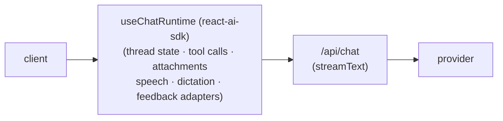

import { VercelIcon } from "@/components/icons/vercel";

[Vercel AI SDK](https://ai-sdk.dev/) is the most common framework people pair with assistant-ui. The full setup, attachments, persistence, tool-call patterns, and version notes are documented under [runtimes/ai-sdk](/docs/runtimes/ai-sdk); this page is the entry point in the integrations tree for discoverability and architecture context.

<Callout type="info">
If you arrived here looking to wire up your first chat: jump to [AI SDK v6 quickstart](/docs/runtimes/ai-sdk/v6). This page is a high-level pointer.
</Callout>

## Where it slots in

`@assistant-ui/react-ai-sdk` wraps the AI SDK's `useChat` hook and exposes it as an assistant-ui runtime. The runtime owns conversation state on the client; your `/api/chat` route returns a UI message stream from `streamText`. Everything else (tools, attachments, observability, gateways, custom persistence) layers on top of this base.

## Pick a version

Three versions of `ai` are supported. New projects should pick **v6**; v5 and v4 are documented for migration and existing apps that haven't upgraded.

<Cards>
  <Card
    icon={<VercelIcon width={20} height={20} />}
    title="AI SDK v6 (current)"
    description="Requires ai@^6 and @ai-sdk/react@^3. Async convertToModelMessages, tool inputSchema, toUIMessageStreamResponse."
    href="/docs/runtimes/ai-sdk/v6"
  />
  <Card
    icon={<VercelIcon width={20} height={20} />}
    title="AI SDK v5 (legacy)"
    description="Requires ai@^5 and @ai-sdk/react@^2. Synchronous convertToModelMessages, transitional API."
    href="/docs/runtimes/ai-sdk/v5-legacy"
  />
  <Card
    icon={<VercelIcon width={20} height={20} />}
    title="AI SDK v4 (legacy)"
    description="The original useChat-based path. Maintained for migration only."
    href="/docs/runtimes/ai-sdk/v4-legacy"
  />
</Cards>

## When to pick AI SDK

AI SDK is the default choice for new projects on Next.js, Remix, or any framework with a Node-compatible API route. Pick it when:

- You want a single direct path from the chat UI to your model with the smallest possible code surface.
- You will compose with a framework like [Mastra](/docs/integrations/frameworks/mastra/overview), an [observability tool](/docs/integrations/observability/helicone), an [LLM gateway](/docs/integrations/gateways), or [tools through MCP](/docs/tools/mcp), all of which assume an AI SDK route.
- You want first-party `frontendTools`, attachments, multi-step tool calls, token-usage metadata, and persisted history via `withFormat`.

If you need streaming agent state (subgraph events, generative UI messages), look at [LangGraph](/docs/runtimes/langgraph) instead. If you have a different protocol-shaped backend (A2A, AG-UI, OpenCode), see [pick a runtime](/docs/runtimes/pick-a-runtime).

## Related

<Cards>
  <Card
    icon={<VercelIcon width={20} height={20} />}
    title="AI SDK runtime overview"
    description="The full runtime documentation and version selector."
    href="/docs/runtimes/ai-sdk"
  />
  <Card
    title="Pick a runtime"
    description="Decision guide if you're not sure AI SDK is the right runtime."
    href="/docs/runtimes/pick-a-runtime"
  />
  <Card
    title="Mastra"
    description="The other framework integration in this section. Wired through AI SDK."
    href="/docs/integrations/frameworks/mastra/overview"
  />
</Cards>
