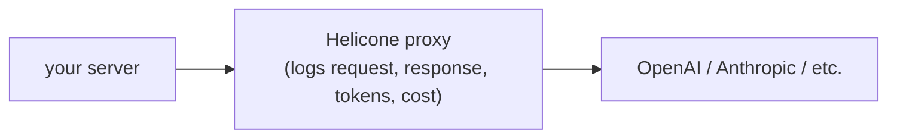

import { VercelIcon } from "@/components/icons/vercel";

[Helicone](https://www.helicone.ai/) is an LLM observability proxy. Point your provider client at Helicone's URL, add an auth header, and every request and response is recorded with cost, latency, and prompt-level diffs.

Helicone is independent of which assistant-ui runtime you use. It slots in at the LLM-client layer (OpenAI SDK, AI SDK provider, or any HTTP-based provider client) on the server, not at the assistant-ui client runtime layer. So it pairs with any backend: AI SDK, LangGraph, Mastra, custom.

## How it works



Calls pass through Helicone's edge before reaching the upstream provider. The proxy is transparent: response shape and streaming behavior are unchanged, you just gain a dashboard of every call.

## Setup

<Steps>
<Step>

### Get a Helicone API key

Sign up at [helicone.ai](https://www.helicone.ai/) and copy the key from the dashboard. Add it to your environment alongside the provider key:

```sh title=".env.local"
HELICONE_API_KEY=sk-helicone-...
OPENAI_API_KEY=sk-...
```

</Step>
<Step>

### Point the provider client at the proxy

Swap the provider's `baseURL` for Helicone's proxy URL and add the `Helicone-Auth` header.

<Tabs items={["AI SDK", "OpenAI SDK"]}>
<Tab value="AI SDK">

```ts title="app/api/chat/route.ts"
import { createOpenAI } from "@ai-sdk/openai";
import { streamText, convertToModelMessages } from "ai";
import type { UIMessage } from "ai";

const openai = createOpenAI({
  baseURL: "https://oai.helicone.ai/v1",
  headers: {
    "Helicone-Auth": `Bearer ${process.env.HELICONE_API_KEY}`,
  },
});

export async function POST(req: Request) {
  const { messages }: { messages: UIMessage[] } = await req.json();
  const result = streamText({
    model: openai("gpt-5.4-mini"),
    messages: await convertToModelMessages(messages),
  });
  return result.toUIMessageStreamResponse();
}
```

</Tab>
<Tab value="OpenAI SDK">

```ts title="app/api/chat/route.ts"
import OpenAI from "openai";

const openai = new OpenAI({
  baseURL: "https://oai.helicone.ai/v1",
  defaultHeaders: {
    "Helicone-Auth": `Bearer ${process.env.HELICONE_API_KEY}`,
  },
});

export async function POST(req: Request) {
  const { messages } = await req.json();
  const stream = await openai.chat.completions.create({
    model: "gpt-5.4-mini",
    messages,
    stream: true,
  });
  return new Response(stream.toReadableStream());
}
```

If you're calling the OpenAI SDK directly, you'll also need to adapt the response into a stream `useChatRuntime` understands. The AI SDK tab above handles this for you.

</Tab>
</Tabs>

</Step>
<Step>

### Verify in the dashboard

Send a message through your assistant. The call should appear in the Helicone dashboard within a few seconds, with token counts, latency, and the full prompt and completion text.

If nothing appears, check the request in your network tab. The host should be `oai.helicone.ai`, not `api.openai.com`; the request should carry `Helicone-Auth` (added explicitly above) and `Authorization` (added automatically by the OpenAI client from `OPENAI_API_KEY`).

</Step>
</Steps>

## Notes

- **Server-side only.** Never set the Helicone key in client code; the proxy receives your provider key and must run server-side.
- **Other providers.** For Anthropic, Gemini, and others, swap the base URL: see Helicone's [provider docs](https://docs.helicone.ai/getting-started/integration-method/gateway).
- **Custom metadata.** Add `Helicone-User-Id`, `Helicone-Property-*`, or session headers per request to filter and aggregate in the dashboard. The headers are in the [request headers reference](https://docs.helicone.ai/helicone-headers/header-directory).
- **Streaming, tools, attachments** all keep working unchanged because Helicone wraps the underlying provider transparently.

## Related

<Cards>
  <Card
    title="Pick a runtime"
    description="Choose a backend integration; Helicone pairs with any of them."
    href="/docs/runtimes/pick-a-runtime"
  />
  <Card
    icon={<VercelIcon width={20} height={20} />}
    title="AI SDK runtime"
    description="The most common pairing: AI SDK route handler proxied through Helicone."
    href="/docs/runtimes/ai-sdk/v6"
  />
</Cards>
