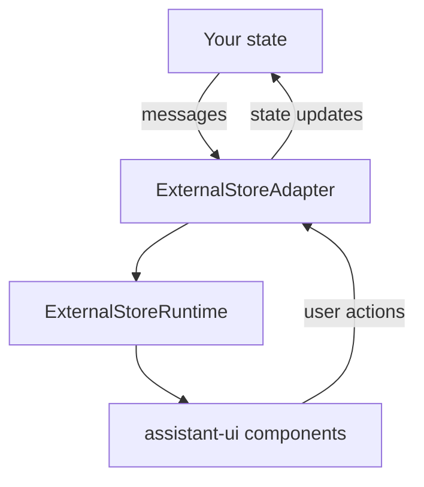

`ExternalStoreRuntime` bridges your existing state management with assistant-ui. You provide messages and callbacks; the runtime renders whatever you give it. UI features turn on based on which callbacks are present.

## When to use it

Pick `ExternalStoreRuntime` when:

- You already keep messages in redux, zustand, tanstack-query, or another store, and want to keep them there.
- You want full control over message state, persistence, and synchronization.
- You have a custom message format and need automatic conversion to assistant-ui's format.

If you do not have an existing store, use [`LocalRuntime`](/docs/runtimes/custom/local-runtime) instead; it is lower-friction.

## Architecture



Key idea: you own the state, the adapter translates between your format and assistant-ui's. UI features are capability-based; if you provide `setMessages`, branching turns on; if you provide `onEdit`, editing turns on; etc.

## Quickstart

<Steps>
<Step>

### Install

<InstallCommand npm={["@assistant-ui/react"]} />

</Step>
<Step>

### Create the runtime provider

```tsx title="app/MyRuntimeProvider.tsx"
"use client";

import { useState, ReactNode } from "react";
import {
  useExternalStoreRuntime,
  ThreadMessageLike,
  AppendMessage,
  AssistantRuntimeProvider,
} from "@assistant-ui/react";

type MyMessage = { role: "user" | "assistant"; content: string };

const convertMessage = (message: MyMessage): ThreadMessageLike => ({
  role: message.role,
  content: [{ type: "text", text: message.content }],
});

const backendApi = async (input: string): Promise<MyMessage> => {
  return { role: "assistant", content: "Hello, world!" };
};

export function MyRuntimeProvider({
  children,
}: Readonly<{ children: ReactNode }>) {
  const [isRunning, setIsRunning] = useState(false);
  const [messages, setMessages] = useState<MyMessage[]>([]);

  const onNew = async (message: AppendMessage) => {
    if (message.content[0]?.type !== "text") {
      throw new Error("Only text messages are supported");
    }
    const input = message.content[0].text;
    setMessages((prev) => [...prev, { role: "user", content: input }]);

    setIsRunning(true);
    const assistant = await backendApi(input);
    setMessages((prev) => [...prev, assistant]);
    setIsRunning(false);
  };

  const runtime = useExternalStoreRuntime({
    isRunning,
    messages,
    convertMessage,
    onNew,
  });

  return (
    <AssistantRuntimeProvider runtime={runtime}>
      {children}
    </AssistantRuntimeProvider>
  );
}
```

</Step>
<Step>

### Use in your app

```tsx title="app/page.tsx"
import { Thread } from "@/components/assistant-ui/thread";
import { MyRuntimeProvider } from "./MyRuntimeProvider";

export default function Page() {
  return (
    <MyRuntimeProvider>
      <Thread />
    </MyRuntimeProvider>
  );
}
```

</Step>
</Steps>

## Message conversion

Two approaches.

### Inline `convertMessage`

```tsx
const convertMessage = (message: MyMessage): ThreadMessageLike => ({
  role: message.role,
  content: [{ type: "text", text: message.text }],
  id: message.id,
  createdAt: new Date(message.timestamp),
});

const runtime = useExternalStoreRuntime({
  messages: myMessages,
  convertMessage,
  onNew,
});
```

### `useExternalMessageConverter` (with join strategy)

For performance optimization or when you need to merge adjacent assistant messages:

```tsx
import { useExternalMessageConverter } from "@assistant-ui/react";

const convertedMessages = useExternalMessageConverter({
  callback: (message: MyMessage): ThreadMessageLike => ({
    role: message.role,
    content: [{ type: "text", text: message.text }],
    id: message.id,
  }),
  messages,
  isRunning: false,
  joinStrategy: "concat-content", // merges adjacent assistant messages
});

const runtime = useExternalStoreRuntime({
  messages: convertedMessages,
  onNew,
});
```

`joinStrategy` controls how adjacent assistant messages combine: `concat-content` (default) merges them into one; `none` keeps them separate.

## Handler matrix

Each handler enables a specific UI feature.

| Handler | Enables |
| --- | --- |
| `onNew` | Sending new user messages (required) |
| `setMessages` | Branch switching |
| `onEdit` | Message edit button |
| `onReload` | Regenerate button |
| `onCancel` | Cancel button while generating |
| `onAddToolResult` | Client-side tool result handoff |

## Streaming responses

Stream by mutating the assistant message in place:

```tsx
const onNew = async (message: AppendMessage) => {
  const userMsg: ThreadMessageLike = {
    role: "user",
    content: message.content,
    id: generateId(),
  };
  setMessages((prev) => [...prev, userMsg]);

  setIsRunning(true);
  const assistantId = generateId();
  setMessages((prev) => [
    ...prev,
    { role: "assistant", content: [{ type: "text", text: "" }], id: assistantId },
  ]);

  const stream = await api.streamChat(message);
  for await (const chunk of stream) {
    setMessages((prev) =>
      prev.map((m) =>
        m.id === assistantId
          ? {
              ...m,
              content: [
                { type: "text", text: (m.content[0] as any).text + chunk },
              ],
            }
          : m,
      ),
    );
  }
  setIsRunning(false);
};
```

## Message editing

```tsx
const onEdit = async (message: AppendMessage) => {
  const index = messages.findIndex((m) => m.id === message.parentId) + 1;
  const newMessages = [...messages.slice(0, index)];
  newMessages.push({
    role: "user",
    content: message.content,
    id: message.id ?? generateId(),
  });
  setMessages(newMessages);

  setIsRunning(true);
  const response = await api.chat(message);
  newMessages.push({ role: "assistant", content: response.content, id: generateId() });
  setMessages(newMessages);
  setIsRunning(false);
};
```

## Branching

The linear `messages` array assumes each message's parent is the previous one. For branching (e.g. multiple regenerations), use `ExportedMessageRepository.fromBranchableArray()` and import via `thread.import()`:

```tsx
import {
  ExportedMessageRepository,
  useExternalStoreRuntime,
} from "@assistant-ui/react";

const backendMessages = [
  { id: "user-1", role: "user", content: "Hello", parentId: null },
  { id: "asst-1", role: "assistant", content: "Hi!", parentId: "user-1" },
  { id: "asst-2", role: "assistant", content: "Hey!", parentId: "user-1" }, // branch
];

const repo = ExportedMessageRepository.fromBranchableArray(
  backendMessages.map((m) => ({
    message: { id: m.id, role: m.role, content: m.content },
    parentId: m.parentId,
  })),
  { headId: "asst-1" },
);

runtime.thread.import(repo);
```

Each message must have an explicit `id` and `parentId`; messages with the same `parentId` create branches. Parents must appear before children in the array.

## Tool calling

Handle tool results by updating the matching tool-call entry:

```tsx
const onAddToolResult = (options: AddToolResultOptions) => {
  setMessages((prev) =>
    prev.map((message) =>
      message.id === options.messageId
        ? {
            ...message,
            content: message.content.map((part) =>
              part.type === "tool-call" &&
              part.toolCallId === options.toolCallId
                ? { ...part, result: options.result }
                : part,
            ),
          }
        : message,
    ),
  );
};

const runtime = useExternalStoreRuntime({
  messages,
  onNew,
  onAddToolResult,
});
```

The runtime automatically matches tool results to their tool calls by `toolCallId` and groups related messages for display.

## Attachments

Attachments use the standard adapter contract, see [adapters](/docs/runtimes/concepts/adapters#attachment-adapter):

```tsx
const runtime = useExternalStoreRuntime({
  messages,
  onNew,
  adapters: { attachments: myAttachmentAdapter },
});
```

## Multi-thread

`ExternalStoreRuntime` uses `ExternalStoreThreadListAdapter` (synchronous, inline). See [threads](/docs/runtimes/concepts/threads#externalstorethreadlistadapter) for the contract and best practices on keeping `currentThreadId` in sync with your store.

## Integration examples

### Redux

```tsx title="app/chatSlice.ts"
import { createSlice, PayloadAction } from "@reduxjs/toolkit";
import { ThreadMessageLike } from "@assistant-ui/react";

const chatSlice = createSlice({
  name: "chat",
  initialState: { messages: [] as ThreadMessageLike[], isRunning: false },
  reducers: {
    setMessages: (state, action: PayloadAction<ThreadMessageLike[]>) => {
      state.messages = action.payload;
    },
    addMessage: (state, action: PayloadAction<ThreadMessageLike>) => {
      state.messages.push(action.payload);
    },
    setIsRunning: (state, action: PayloadAction<boolean>) => {
      state.isRunning = action.payload;
    },
  },
});

export const { setMessages, addMessage, setIsRunning } = chatSlice.actions;
```

```tsx title="app/ReduxRuntimeProvider.tsx"
import { useSelector, useDispatch } from "react-redux";
import { useExternalStoreRuntime, AssistantRuntimeProvider } from "@assistant-ui/react";

export function ReduxRuntimeProvider({ children }) {
  const messages = useSelector((s: RootState) => s.chat.messages);
  const isRunning = useSelector((s: RootState) => s.chat.isRunning);
  const dispatch = useDispatch();

  const runtime = useExternalStoreRuntime({
    messages,
    isRunning,
    setMessages: (messages) => dispatch(setMessages(messages)),
    onNew: async (message) => {
      dispatch(
        addMessage({
          role: "user",
          content: message.content,
          id: `msg-${Date.now()}`,
          createdAt: new Date(),
        }),
      );
      dispatch(setIsRunning(true));
      const response = await api.chat(message);
      dispatch(
        addMessage({
          role: "assistant",
          content: response.content,
          id: `msg-${Date.now()}`,
          createdAt: new Date(),
        }),
      );
      dispatch(setIsRunning(false));
    },
  });

  return (
    <AssistantRuntimeProvider runtime={runtime}>
      {children}
    </AssistantRuntimeProvider>
  );
}
```

### Zustand

```tsx title="app/chatStore.ts"
import { create } from "zustand";
import { immer } from "zustand/middleware/immer";
import { ThreadMessageLike } from "@assistant-ui/react";

interface ChatState {
  messages: ThreadMessageLike[];
  isRunning: boolean;
  addMessage: (message: ThreadMessageLike) => void;
  setMessages: (messages: ThreadMessageLike[]) => void;
  setIsRunning: (isRunning: boolean) => void;
}

export const useChatStore = create<ChatState>()(
  immer((set) => ({
    messages: [],
    isRunning: false,
    addMessage: (message) => set((s) => { s.messages.push(message); }),
    setMessages: (messages) => set((s) => { s.messages = messages; }),
    setIsRunning: (isRunning) => set((s) => { s.isRunning = isRunning; }),
  })),
);
```

```tsx title="app/ZustandRuntimeProvider.tsx"
import { useShallow } from "zustand/shallow";
import { useExternalStoreRuntime, AssistantRuntimeProvider } from "@assistant-ui/react";

export function ZustandRuntimeProvider({ children }) {
  const { messages, isRunning, addMessage, setMessages, setIsRunning } =
    useChatStore(
      useShallow((s) => ({
        messages: s.messages,
        isRunning: s.isRunning,
        addMessage: s.addMessage,
        setMessages: s.setMessages,
        setIsRunning: s.setIsRunning,
      })),
    );

  const runtime = useExternalStoreRuntime({
    messages,
    isRunning,
    setMessages,
    onNew: async (message) => {
      addMessage({
        role: "user",
        content: message.content,
        id: `msg-${Date.now()}`,
        createdAt: new Date(),
      });
      setIsRunning(true);
      const response = await api.chat(message);
      addMessage({
        role: "assistant",
        content: response.content,
        id: `msg-${Date.now()}-a`,
        createdAt: new Date(),
      });
      setIsRunning(false);
    },
  });

  return (
    <AssistantRuntimeProvider runtime={runtime}>
      {children}
    </AssistantRuntimeProvider>
  );
}
```

### TanStack Query

```tsx
import { useQuery, useMutation, useQueryClient } from "@tanstack/react-query";
import { useExternalStoreRuntime } from "@assistant-ui/react";

const messageKeys = {
  all: ["messages"] as const,
  thread: (threadId: string) => [...messageKeys.all, threadId] as const,
};

export function TanStackQueryRuntimeProvider({ children }) {
  const queryClient = useQueryClient();
  const threadId = "main";

  const { data: messages = [] } = useQuery({
    queryKey: messageKeys.thread(threadId),
    queryFn: () => fetchMessages(threadId),
  });

  const sendMessage = useMutation({
    mutationFn: api.chat,
    onMutate: async (message: AppendMessage) => {
      await queryClient.cancelQueries({
        queryKey: messageKeys.thread(threadId),
      });
      const previous = queryClient.getQueryData<ThreadMessageLike[]>(
        messageKeys.thread(threadId),
      );
      queryClient.setQueryData<ThreadMessageLike[]>(
        messageKeys.thread(threadId),
        (old = []) => [
          ...old,
          {
            role: "user",
            content: message.content,
            id: `temp-${Date.now()}`,
            createdAt: new Date(),
          },
        ],
      );
      return { previous };
    },
    onError: (_err, _msg, context) => {
      if (context?.previous) {
        queryClient.setQueryData(messageKeys.thread(threadId), context.previous);
      }
    },
    onSettled: () =>
      queryClient.invalidateQueries({ queryKey: messageKeys.thread(threadId) }),
  });

  const runtime = useExternalStoreRuntime({
    messages,
    isRunning: sendMessage.isPending,
    onNew: async (message) => {
      await sendMessage.mutateAsync(message);
    },
    setMessages: (newMessages) => {
      queryClient.setQueryData(messageKeys.thread(threadId), newMessages);
    },
  });

  return (
    <AssistantRuntimeProvider runtime={runtime}>
      {children}
    </AssistantRuntimeProvider>
  );
}
```

## Working with external messages

### `getExternalStoreMessages`

Retrieve your original message format from any assistant-ui state:

```tsx
import { getExternalStoreMessages, useAuiState } from "@assistant-ui/react";

function MyComponent() {
  const originalMessages = useAuiState((s) => getExternalStoreMessages(s.message));
  // originalMessages is MyMessage[] (your original type)
}
```

<Callout type="warn">
`getExternalStoreMessages` may return multiple messages for a single UI message; assistant-ui merges adjacent assistant and tool messages for display.
</Callout>

### `bindExternalStoreMessage`

Attach your original message to a `ThreadMessage` you constructed manually (outside the built-in converter):

```tsx
import {
  bindExternalStoreMessage,
  getExternalStoreMessages,
} from "@assistant-ui/react";

bindExternalStoreMessage(threadMessage, originalMessage);
const original = getExternalStoreMessages(threadMessage);
```

`bindExternalStoreMessage` is a no-op if the target already has a bound message. It mutates the target in place.

<Callout type="warn">
This API is experimental and may change without notice.
</Callout>

## Best practices

1. **Immutable updates.** Always create new arrays:
   ```tsx
   setMessages([...messages, newMessage]); // not messages.push(newMessage)
   ```
2. **Stable handler references.** Memoize `onNew`, `onEdit`, etc. with `useCallback` to avoid recreating the runtime.
3. **Use `useShallow`** with zustand to prevent unnecessary re-renders.

## Common pitfalls

**Edit / regenerate / cancel buttons missing.** Each requires its handler:

```tsx
useExternalStoreRuntime({
  messages,
  onNew, // required
  setMessages, // branch switching
  onEdit, // edit
  onReload, // regenerate
  onCancel, // cancel
});
```

**State not updating.** check for: array mutation instead of new arrays, missing `setMessages`, broken async handling, or invalid `convertMessage` output.

**Messages going to the wrong thread.** the runtime's `currentThreadId` and your store's selected thread must stay in sync. Centralize thread id in a context, never in component-local state. See [threads](/docs/runtimes/concepts/threads#externalstorethreadlistadapter).

## API reference

### `ExternalStoreAdapter`

<ParametersTable
  type="ExternalStoreAdapter<T>"
  parameters={[
    {
      name: "messages",
      type: "readonly T[]",
      description: "Array of messages from your state.",
      required: true,
    },
    {
      name: "onNew",
      type: "(message: AppendMessage) => Promise<void>",
      description: "Handler for new messages from the user.",
      required: true,
    },
    {
      name: "isRunning",
      type: "boolean",
      description:
        "Whether the assistant is currently generating a response. When true, shows an optimistic assistant message and flows directly to thread.isRunning.",
      default: "false",
    },
    {
      name: "isDisabled",
      type: "boolean",
      description:
        "Disables the entire composer, including the text input. For a narrower gate that keeps the input usable but blocks only sending, use isSendDisabled.",
      default: "false",
    },
    {
      name: "isSendDisabled",
      type: "boolean",
      description:
        "Blocks new-message sending while leaving the input usable. When true, the thread composer's canSend becomes false, the Send button is disabled, Enter and the steer hotkey are no-ops, and aui.composer().send() short-circuits. Edit composers (saving message edits) ignore this flag. Use this to gate sending on external React state (e.g. while tools or auth are still loading).",
      default: "false",
    },
    {
      name: "isLoading",
      type: "boolean",
      description:
        "Whether the adapter is in a loading state. Displays a loading indicator instead of the composer.",
    },
    {
      name: "suggestions",
      type: "readonly ThreadSuggestion[]",
      description: "Suggested prompts to display.",
    },
    {
      name: "extras",
      type: "unknown",
      description: "Additional data accessible via runtime.extras.",
    },
    {
      name: "setMessages",
      type: "(messages: readonly T[]) => void",
      description: "Update messages (required for branch switching).",
    },
    {
      name: "onEdit",
      type: "(message: AppendMessage) => Promise<void>",
      description: "Handler for message edits (required for edit feature).",
    },
    {
      name: "onReload",
      type: "(parentId: string | Null, config: StartRunConfig) => Promise<void>",
      description:
        "Handler for regenerating messages (required for reload feature).",
    },
    {
      name: "onCancel",
      type: "() => Promise<void>",
      description: "Handler for cancelling the current generation.",
    },
    {
      name: "onAddToolResult",
      type: "(options: AddToolResultOptions) => Promise<void> | Void",
      description: "Handler for adding tool call results.",
    },
    {
      name: "onResume",
      type: "(config: ResumeRunConfig) => Promise<void>",
      description:
        "Handler for resuming an interrupted run (e.g. after a page reload mid-generation).",
    },
    {
      name: "onResumeToolCall",
      type: "(options: { toolCallId: string; payload: unknown }) => void",
      description:
        "Handler for resuming a suspended tool call (used with human-in-the-loop tool execution).",
    },
    {
      name: "messageRepository",
      type: "ExportedMessageRepository",
      description:
        "Pre-built message repository with branching history. Use instead of messages when you need to restore branch state.",
    },
    {
      name: "state",
      type: "ReadonlyJSONValue",
      description:
        "Opaque serializable state passed to onLoadExternalState during thread import.",
    },
    {
      name: "onImport",
      type: "(messages: readonly ThreadMessage[]) => void",
      description:
        "Called when the runtime imports messages into the external store (e.g. on thread switch).",
    },
    {
      name: "onExportExternalState",
      type: "() => any",
      description:
        "Called to retrieve external state when the runtime exports a thread snapshot.",
    },
    {
      name: "onLoadExternalState",
      type: "(state: any) => void",
      description:
        "Called with previously exported external state when restoring a thread snapshot.",
    },
    {
      name: "convertMessage",
      type: "(message: T, index: number) => ThreadMessageLike",
      description:
        "Convert your message format to assistant-ui format. Not needed if using ThreadMessage type.",
    },
    {
      name: "adapters",
      type: "object",
      description:
        "Capability adapters: attachments, speech, dictation, feedback, threadList. See /docs/runtimes/concepts/adapters.",
    },
    {
      name: "unstable_capabilities",
      type: "object",
      description:
        "Configure runtime capabilities (e.g. copy). Unstable, may change.",
    },
  ]}
/>

### `ThreadMessageLike`

<ParametersTable
  type="ThreadMessageLike"
  parameters={[
    {
      name: "role",
      type: '"assistant" | "user" | "system"',
      description: "The role of the message sender.",
      required: true,
    },
    {
      name: "content",
      type: "string | Readonly MessagePart[]",
      description:
        "Message content as string or structured message parts. Supports data-* prefixed types (e.g. { type: \"data-workflow\", data: {...} }) which are automatically converted to DataMessagePart.",
      required: true,
    },
    {
      name: "id",
      type: "string",
      description: "Unique identifier for the message.",
    },
    {
      name: "createdAt",
      type: "Date",
      description: "Timestamp when the message was created.",
    },
    {
      name: "status",
      type: "MessageStatus",
      description:
        'Status of assistant messages ({ type: "running" }, { type: "complete" }, { type: "incomplete" }).',
    },
    {
      name: "attachments",
      type: "readonly CompleteAttachment[]",
      description:
        'File attachments (user messages only). Type accepts custom strings beyond "image" | "document" | "file"; contentType is optional.',
    },
    {
      name: "metadata",
      type: "object",
      description: "Additional message metadata (steps, custom fields).",
    },
  ]}
/>

## Related

<Cards>
  <Card
    title="LocalRuntime"
    description="Simpler core runtime when you do not have your own state store."
    href="/docs/runtimes/custom/local-runtime"
  />
  <Card
    title="Adapters"
    description="Attachments, speech, feedback, history, suggestions."
    href="/docs/runtimes/concepts/adapters"
  />
  <Card
    title="Threads"
    description="ExternalStoreThreadListAdapter for multi-thread."
    href="/docs/runtimes/concepts/threads"
  />
</Cards>
